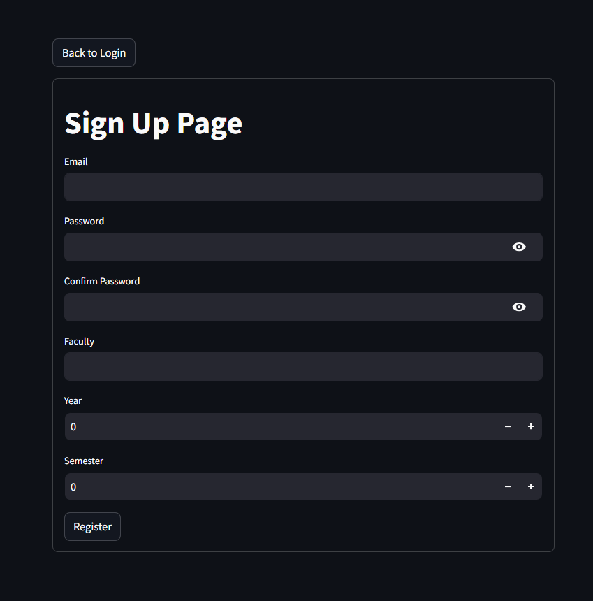

# Streamlit Authentication Template

[](https://shields.io/)
[](https://shields.io/)
[](https://shields.io/)

## Description

This is a template for building a Streamlit application that handles user authentication and stores user data in a PostgreSQL database. It includes features for navigation among login state, signup state, and app state with authentication through database management.


## Features
- Navigation among login state, signup state, and app state
- User authentication with PostgreSQL database
    
- Store the hashed password in database only
    
- OTP for email verification
    
- Customisation for input fields in signup page
    

## Prerequisite 
* Install PostgreSQL

    * For Windows:
        Download and install PostgreSQL from [https://www.enterprisedb.com/downloads/postgres-postgresql-downloads](https://www.enterprisedb.com/downloads/postgres-postgresql-downloads)

    * For macOS:
        * Install PostgreSQL using Homebrew:
            ```bash
            brew install postgresql
            ```


## Installation

```
git clone https://github.com/szeyu/streamlit-authentication-template.git
```

```
cd streamlit-authentication-template
```

```
conda create -n <VENV> python=3.10
```

```
conda activate <VENV>
```

```
pip install -r requirements.txt
```

## Setup

1. Set the variable in `.env`
    * `DB_HOST`: PostgreSQL host
    * `DB_NAME`: PostgreSQL database name
    * `DB_USER`: PostgreSQL username
    * `DB_PASS`: PostgreSQL password
    * `DB_PORT`: PostgreSQL port
    * `sender_mail`: The email you wanna use to send to user for OTP verification
    * `sender_mail_pass`: This should be your App Password if 2FA is enabled 

2. Customise your own input fields for signup page in `navigation.py`
    * Format:
        * "`Input Parameter Name`" : "`Input Parameter Type`"
    * `Input Parameter Type`:
        * text
        * number
    * e.g.
    ```
    st.session_state['extra_input_params'] = {
        'Faculty':'text',
        'Year':'number',
        'Semester':'number',
    }
    ```

3. If you choose to have extra input parameters for your signup page
    * You need to set `extra_input_params=True` for `signup_page()` in `navigation.py`
    ```
    signup_page(
        extra_input_params=True
    )
    ```

4. (Optional) Choose to have confirm password mode for your `signup_page()` in `navigation.py`
    ```
    signup_page(
        confirmPass = True
    )
    ```

5. (Optional) Choose to have guest mode for your `login_page()` in `navigation.py`
    ```
    login_page(guest_mode=True)
    ```

6. If you have extra input parameters, you can copy this prompt to any LLM and request for the create database SQL code. Copy:

    ```System Prompt
        Create a PostgreSQL table schema for a user management system. The table should have the following columns:

        1. `id`: A primary key of type SERIAL.
        2. `email`: A unique, non-nullable VARCHAR(255) field.
        3. `hash_password`: A non-nullable TEXT field.

        Additionally, include the following columns based on user input parameters:

        <extra_input_params> = {
            
        }

        The generated SQL should be a valid `CREATE TABLE` command in PostgreSQL.
        
        output format:
        CREATE TABLE IF NOT EXISTS users (
            id SERIAL PRIMARY KEY,
            email VARCHAR(255) UNIQUE NOT NULL,
            hash_password TEXT NOT NULL,
            <extra_input_param> <extra_input_param type> NOT NULL,
        );
    ```

    * Remember to replace this with your extra input params as you type in streamlit
    ```
    <extra_input_params> = {
            
    }
    ```

    * Then replace `# Create the table` in the `create_table()` in `db/create_db.py` with the SQL create table code generated by LLM

7.  * To create DB:
        ```
        python db/create_db.py
        ```
    * To delete DB:
        ```
        python db/delete_db.py
        ```

8. Run the code!
    ```
    streamlit run navigation.py
    ```